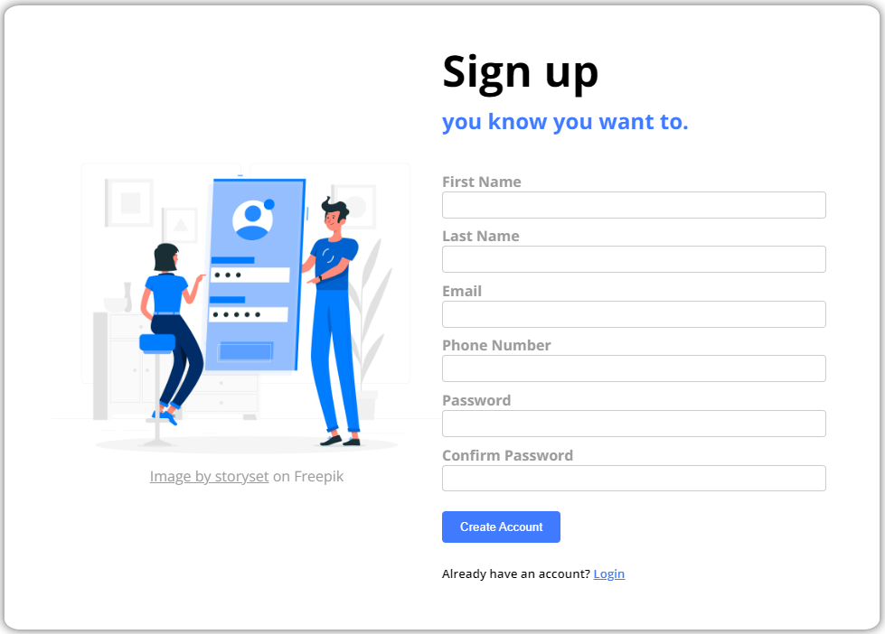
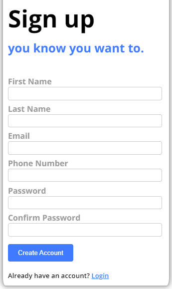

# Sign-up Form

This project is a simple web page designed for user sign-up with basic CSS animations.

## Features

- User-friendly sign-up form.
<p align="center">
  
</p>
- CSS animations for interactive elements.
- Responsive design for various screen sizes.
<p align="center">
  
</p>
- Validation for matching passwords.
- Easily customizable using CSS variables.

## Usage

1. Clone the repository to your local machine.

```bash
git clone https://github.com/guacamoley/signup-webpage.git
```

2. Open the index.html file in your web browser to view the webpage.

## Customization

You can customize the web page by modifying the style.css file. You can change colors, fonts, and styles by editing the CSS variables in the :root section.

```
:root {
    --main-background-color: #FFFFFF;
    --background-section-color: #9b9b9b;
    --highlight-color: #FFEB3B;
    --secondary-color: #6495ff;
    --primary-color: #407BFF;
    /* Add or update more variables as needed */
}
```

## License

This project is open-source and available under the [MIT License](LICENSE). Feel free to use and modify it for your own projects.

## Acknowledgements

Background image by [storyset](https://www.freepik.com/free-vector/mobile-login-concept-illustration_4957136.htm#query=sign%20up%20page&position=31&from_view=search&track=ais) on Freepik.
